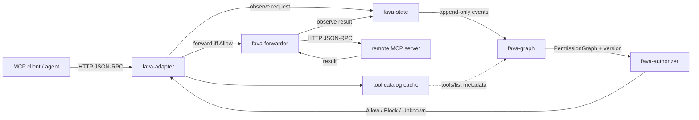

# FAVA implementation plan

Status of Phase 1 and the path to the full FAVA gateway.

Phase 1 is complete and tested: a pass-through MCP reverse proxy
(`src/mcp_proxy/`) that relays JSON-RPC to a backend over Streamable HTTP and
exposes read-only observation hooks. Everything below builds on that seam.

The paper is `docs/FAVA_ Formal Authorization for Verified Agents with
Evidence-Backed Permission Graphs.html` (arXiv:2607.27267v1 [cs.CR]).

## Where Phase 1 already lands

The proxy is the **runtime enforcement gateway** of the paper's macro
architecture (§ Runtime Enforcement). It is in the right place — it mediates
every tool call between agent and backend — but today it mediates without
deciding: it observes and forwards. Nothing yet builds a Permission IR, an
evidence graph, or consults an authorizer.

What Phase 1 settled, and that later phases should not re-litigate:

- Interception point is a raw ASGI relay, not a session-level proxy. This makes
  the gateway protocol-version-agnostic (it carries both the 2025-era stateful
  envelope and the stateless `2026-07-28` envelope with no per-method code).
- Hooks are read-only and best-effort. The gateway degrades to a pure relay if
  an observer breaks, which is the correct failure mode for Phase 1 but must
  **not** survive into the enforcement phase — see "Fail closed" below.
- `RequestContext.is_effectful` already implements the conservative
  classification the authorizer will gate on: handshake, `ping`, and catalog
  reads are non-effectful; unknown methods and unparseable bodies count as
  effectful.

## Target component decomposition

Five components, matching the paper's macro blocks. Only the forwarder exists.



| Component | Status | Responsibility |
|---|---|---|
| `fava-forwarder` | **done** (`relay.py`) | Unchanged remote MCP forwarding |
| `fava-adapter` | skeleton (`relay.py`, `hooks.py`) | Interception, `run_id` propagation, catalog cache, event recording |
| `fava-state` | not started | Per-run state: `run_id → PermissionGraph + events + policy context`, append-only, graph versioning |
| `fava-graph` | not started | Node/edge construction, deterministic lowering, structural + evidential validation |
| `fava-authorizer` | not started | `Allow / Block / Unknown` decision; SMT backend later; fail closed |

Keep them as modules of one package initially (`fava.state`, `fava.graph`, …).
Splitting into separate distributions is premature: the interfaces matter, the
process boundaries do not.

## Phase 2 — run identity and event recording

**Goal:** attach every observed call to a run, and record it append-only.

The critical gap today is that hooks see **HTTP connections, not agent runs.**
FAVA's graphs are per-run, so this must be solved first; nothing else can be
trusted without it (§ Concurrency Model).

- Derive or propagate a `run_id`. Options, in order of preference:
  1. Trust a client-supplied header (e.g. `X-FAVA-Run-Id`) when the agent
     runtime can set one — cleanest, needs cooperation.
  2. Bind to `Mcp-Session-Id` — free, but **absent** in the stateless
     `2026-07-28` envelope, so it cannot be the only mechanism.
  3. Fall back to peer `(host, port)` plus a session-open event — coarse;
     multiple runs can share a connection.
  Whichever wins, `run_id` must be explicit state, never inferred from the
  connection alone.
- Event record (per paper § Evidence): `event_id`, `run_id`, `parent_event_id`,
  monotonic sequence + timestamp, tool name, argument metadata (not necessarily
  full argument values — decide and document the retention policy), request and
  response status, evidence source.
- Append-only. Repair is monotone: events and edges are added, never rewritten
  or deleted (§ Monotonic Runtime Repair).
- `parent_event_id` is what gives the graph its event ancestry, so a nested
  tool call (a tool invocation triggered by another tool's result) links to its
  origin. Phase 2 can leave it null; the field must exist from the start.

**Deliverable:** `fava.state.RecordStore` with `observe_request` /
`observe_result`, wired into `hooks.py`. In-memory first; Redis behind the same
interface if state must survive a proxy restart.

## Phase 3 — tool catalog

**Goal:** know what a tool *is* before it is called, without rewriting
`tools/list`.

- Populate via MCP `initialize` (or `server/discover`) + `tools/list` against
  the backend, on proxy startup and on reconnect.
- Cache key: `mcp_server_identity + authorization_scope + catalog_version`.
- Refresh triggers: capability-change notification, reconnect, config change,
  TTL expiry.
- **Metadata-only.** The catalog feeds the graph with `Node.op`, argument
  schemas and annotations (`readOnlyHint`, `destructiveHint`, `idempotentHint`).
  It must never alter what the agent sees in `tools/list` — the relay stays
  byte-exact.
- Catalog-less fallback: treat unknown tools as effectful and conservative.
  `is_effectful` already does this; keep it.

**Deliverable:** `fava.adapter.ToolCatalog` with `describe(server, tool_name) →
ToolSpec | None`.

## Phase 4 — permission graph

**Goal:** build the evidence-backed graph the authorizer reasons over.

- Nodes: `kind ∈ {context, source, tool, sink}` with `id`, `op`,
  `args`/`outputs`, `labels`, `requests`, `time`.
- Edges: `type ∈ {data, control, parent}` with `src`, `dst`, `evidence`,
  `trust ∈ {observed, policy, inferred}`.
- Deterministic lowering from the recorded events to the graph. Same events ⇒
  same graph, byte-for-byte — required for auditing and for replaying a decision.
- Structural validation (well-formed graph) and evidential validation (every
  edge cites evidence that exists).
- Version the graph: `(run_id, graph_version)`. A decision is bound to the
  version it was made against, so a later append cannot silently widen an
  earlier authorization.

**Deliverable:** `fava.graph.PermissionGraph` plus `fava.graph.lower(events) →
(graph, version)` and `validate(graph) → list[Violation]`.

## Phase 5 — authorizer

**Goal:** a decision on every effectful call, before it is forwarded.

Interface, fixed now so the backend can change underneath it:

```python
authorize(
    run_id: str,
    graph_version: int,
    candidate_action: CandidateAction,
    policy_context: PolicyContext,
) -> Allow | Block | Unknown
```

- `Allow` carries `capability_scope` and `decision_id`.
- `Block` carries `reason`, the violating **evidence references**, and
  `decision_id`.
- **Fail closed on both `Block` and `Unknown`.** An authorizer that errors,
  times out, or cannot decide must deny. This is the single most important
  behavioral change from Phase 1, where hooks are advisory and a failure
  forwards anyway.
- Start with a placeholder policy (deny-by-default on effectful calls, allow
  reads) so the plumbing and the denial path are exercised end to end before
  any solver work. Z3/SMT comes later, behind this same interface.

**Deliverable:** `fava.authorizer.Authorizer` protocol + `PlaceholderAuthorizer`
+ a `DenyResult` that the relay renders as a JSON-RPC error.

## Phase 6 — enforcement in the relay

**Goal:** make the gateway actually gate.

This is the only phase that changes `relay.py` control flow, and it should
change as little as possible:

```python
async def call_tool(run_id, name, arguments):
    event = await state.observe_call(run_id, name, arguments)
    decision = await authorizer.check(run_id, event)
    if not decision.allowed:
        return denied_result(decision)      # local JSON-RPC error, never forwarded
    result = await remote_session.call_tool(name, arguments)
    await state.observe_result(run_id, event, result)
    return result
```

Constraints to preserve:

- Gate on `is_effectful`. Reads, handshake and `ping` must not pay for
  authorization.
- Deny locally with a well-formed JSON-RPC error echoing the request id, so an
  MCP client correlates the failure with its call. `relay._fail` already does
  this for gateway errors and is the right shape to reuse.
- Deny **before** opening the upstream connection.
- Authorization latency sits inline on the tool-call path. Budget it, measure
  it, and keep the placeholder fast enough that Phase 6 does not regress the
  current sub-second round trips.

## Phase 7 — repair and metrics

- Monotone append-only runtime repair: on new evidence, append and re-decide;
  never mutate history. JIT re-authorization for long-running runs.
- Instrument the gateway's decisions and measure **DCR**
  (= (TP+TN)/(TP+TN+FP+FN)) against labelled traces. Without this the
  authorization stage cannot be tuned — a gateway that denies everything is
  perfectly safe and perfectly useless.

## Assumptions that bound the guarantee

The paper is explicit (§ Assumptions, `#L818-L824`) and these transfer here
verbatim:

1. The gateway mediates **all** security-relevant effects. A tool whose effect
   escapes the proxy — direct network access, a side channel, an agent calling
   the backend URL directly — is outside the guarantee. Deployment must ensure
   the backend is unreachable except through the proxy.
2. The backend is capability-conformant: it does what its catalog says.
3. Policy translation and sanitizer specifications are inside the TCB.

Also worth stating plainly: **the initial prompt is optional.** The gateway can
run on tool calls alone, but without task context the graph has less to reason
about, so more requests resolve to `Unknown` — and `Unknown` fails closed. Task
context, when supplied, sharpens decisions rather than enabling them.

## Suggested order and first task

Phases 2 → 6 are strictly sequential: run identity before events, events before
a graph, a graph before a decision, a decision before enforcement. Phase 3
(catalog) is independent and can run in parallel with 4 and 5.

The first concrete task is **Phase 2's `run_id`**, because it is a prerequisite
for everything else and because the stateless `2026-07-28` envelope removes the
obvious answer (`Mcp-Session-Id`). Decide the propagation mechanism first; the
store design follows from it.
